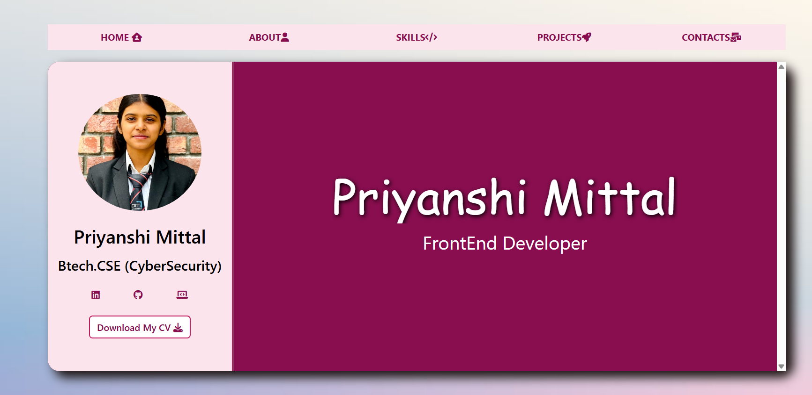

# 🌐 Personal Web Resume – Priyanshi Mittal

This is a responsive and visually appealing personal web resume built using **HTML**, **CSS**, and a touch of **Bootstrap**. It highlights my skills, projects, achievements, and contact information in a clean, single-page format.

---

## ✨ Features

- 🎯 One-page responsive design
- 👩‍💻 "About Me", Skills, Projects, and Contact sections
- 📱 Mobile-friendly layout with media queries
- 📄 Downloadable resume (CV)
- 🌐 Social media links (GitHub, LinkedIn, LeetCode)
- 🎤 Communication & leadership highlights
- 💬 QR code to contact via email

---

## 📸 Preview

## 🛠️ Technologies Used

- HTML5
- CSS3
- Bootstrap (optional components)
- Font Awesome Icons

---

## 📂 Folder Structure
assets/
├── files/
│   └── CV_webResume.pdf
├── images/
│   ├── bg.png
│   ├── flipkart.png
│   ├── haunted.png
│   ├── mail-qr.png
│   ├── news.png
│   ├── profile.png
│   ├── reg.png
│   └── spotify.png
├── stylesheets/
│   └── main.css
javascript/
index.html
